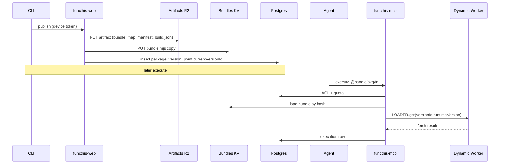
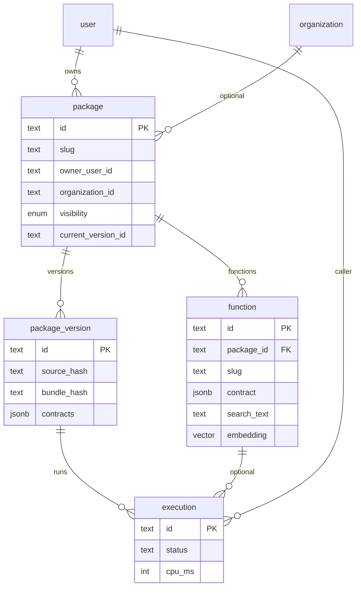

# Architecture

Decisions for the hosted product and CLI. Product intent lives in [vision.md](vision.md). Build order lives in [roadmap.md](roadmap.md).

Public language is **package**. Vision still says “project”; same boundary.

## Hosts

One Cloudflare account.

| Host | Role |
| --- | --- |
| `https://functhis.now` | Marketing, OAuth issuer, owner UI (`/d`), deploy API, `@` package pages |
| `https://mcp.functhis.now` | MCP resource. Tools: `search`, `execute`. Token `aud`. |

No `run.` host. Cookies: `.functhis.now`. `trustedOrigins`: apex + mcp.

Alpha ships two first-party Workers: web, mcp (see [Fleet](#fleet)). Do not add a package-app zone.

## Public URLs

Identity is the URL. GET is the page. POST runs.

```text
https://functhis.now/@xmazu/presentation-tools
https://functhis.now/@xmazu/presentation-tools/generate-presentation
```

- GET HTML: package or function page (contract, examples, try-it). Try-it POSTs.
- GET `Accept: application/json`: contract only. Never execute.
- POST JSON: execute. Same ACL and quotas as MCP `execute`.
- `@` is reserved. Marketing routes do not start with `@`.
- Private: signed-in GET; owner or org member only. Anonymous GET redirects to `/login`. No access → 404. POST needs session or bearer token.
- MCP ids are the path: `@xmazu/presentation-tools/generate-presentation`.

Compute identity is the package version id (`ver_{versionId}`). Slugs can change without moving the isolate.

## Auth

GitHub is the IdP (`socialProviders.github`). Functhis is the OAuth 2.1 authorization server at **`https://functhis.now`**.

Mount **`mcp()`**, not `oauthProvider()`. `mcp()` is that provider with MCP defaults. Do not register both.

```text
GitHub           → session into Functhis
Functhis (mcp()) → AS on functhis.now
mcp.functhis.now → MCP resource
deploy API       → CLI resource (same AS, different audience)
console          → session cookies + issuer pages (same origin as web)
```

`createAuth` plugins:

- `jwt()`
- `mcp({ loginPage, consentPage, resource: "https://mcp.functhis.now" })`
- `cimd({ metadataProfile: "mcp-2026-07-28", fetchClientMetadataResource })` - no DCR unless an old client requires it
- `oauthDeviceAuthorization({ verificationUri: "/device" })`
- `organization()` - Better Auth org plugin; thin console admin at `/organizations` (create, invite via copy link, accept). No outbound invite email in alpha.
- `crossSubDomainCookies` on `.functhis.now`

Login / consent / device pages: `https://functhis.now/...`. Issuer: `https://functhis.now`.

Workers: do not use the Node CIMD transport. Use `global_fetch_strictly_public` on `functhis-web` so `fetch()` refuses private/special-use IPs after DNS. `fetchClientMetadataResource` enforces HTTPS, no credentials/fragments, GET/HEAD only, `redirect: "error"`, timeout + size cap. No userland IP pinning.

Forward issuer well-known URLs to `auth.handler`, not only `/api/auth/*`:

- `{issuer}/.well-known/oauth-authorization-server`
- `{issuer}/.well-known/openid-configuration` if `openid` is issued
- `mcp.functhis.now/.well-known/oauth-protected-resource`
- `/oauth2/authorize`, `/oauth2/token`, `/oauth2/userinfo`, JWKS

MCP POST `/mcp`: `requireMcpAuth` / `createMcpProtectedRequestHandler`. CLI device token is bound to the deploy API resource (`https://functhis.now`), not MCP.

## Owner UI

Signed-in owner app at `apps/web` under `/d` (pkgs, orgs). Visual system: [apps/web/src/routes/d/DESIGN.md](apps/web/src/routes/d/DESIGN.md).

Alpha: GitHub login, MCP consent, device approval, signed-in home, package list at `/d/pkgs`, package detail at `/d/pkgs/:handle/:slug`, organizations at `/d/orgs`, sharing controls on owned packages.

Try-it lives on the public function page. No billing or library browse/catalog UI in alpha.

## MCP

`https://mcp.functhis.now/mcp`. Two tools.

**`search`** - `query`, optional `domain`: `mine` | `org` | `library` (default `mine`). Hybrid: `ILIKE` on handle / slug / `search_text`, plus optional pgvector distance against a Workers AI embedding. Ranked exact-match first, then nearest neighbors the caller may see under the package ACL.

**`execute`** - id + JSON arguments. ACL, quota, Dynamic Worker, execution row. Not one MCP tool per function.

## Fleet

Two product Workers (web, mcp). Untrusted package code runs on MCP (Dynamic Workers), not on the web Worker.

| Script | Public surface | Owns | Binds |
| --- | --- | --- | --- |
| `functhis-web` | `functhis.now` | TanStack Start, marketing, OAuth issuer, `/d` owner UI, `@` pages, deploy API | Neon via Hyperdrive, bundle KV, artifacts R2, Workers AI, `global_fetch_strictly_public`, service binding to mcp |
| `functhis-mcp` | `mcp.functhis.now` | MCP `search` / `execute`, Dynamic Worker execution | Neon via Hyperdrive, bundle KV, `LOADER`, Analytics Engine, Workers AI |

Local `bun run dev` runs web (3001) and MCP (3003). Production deploys **mcp first**, then web.

Cross-worker calls use service bindings. Do not proxy Postgres through RPC; scripts that need the database bind the same Hyperdrive config.

Do not put Durable Object classes on `functhis-web`. If a DO is needed later, add a dedicated script rather than attaching it to origin.

## Infra

Terraform owns account-level resources. Wrangler owns first-party Worker **code** and Hyperdrive binding ids. Never manage the same resource in both. **No Alchemy.**

```text
packages/infra/*.tf          Cloudflare provider v5, R2 remote state (preview/production tfvars)
apps/web/wrangler.jsonc      functhis-web (+ preview/production env blocks)
apps/console/wrangler.jsonc  functhis-console (+ preview/production env blocks)
apps/mcp/wrangler.jsonc      functhis-mcp (+ preview/production env blocks)
```

**Terraform** (`packages/infra`, apply with `preview.tfvars` or `production.tfvars`):

- Zone `functhis.now` (data source), Workers custom domains for the three hostnames (`enable_domains` after first deploy)
- Neon Postgres project stays in the dashboard; connection string in Secrets Store and Hyperdrive origin (Neon **direct** / unpooled host)
- Hyperdrive `functhis-auth-{env}` (caching disabled - console) and `functhis-catalog-{env}` (cache enabled - web and mcp)
- KV `functhis-bundles-{env}`
- R2 `functhis-artifacts-{env}` (published package artifacts; Terraform; not the Terraform state bucket)
- R2 `functhis-tf-state` (state backend only - create once with `wrangler r2 bucket create`; not a Terraform resource)
- Secrets Store `functhis-{env}` (`BETTER_AUTH_SECRET`, GitHub OAuth). Migrations use Neon direct URL from `packages/db/.env` / CI, not Workers.
- Analytics Engine execution metrics: Wrangler-bound on `functhis-mcp` (`functhis_executions` / `functhis_executions_preview`; dataset names in Terraform output `analytics_execution_dataset`)

**Wrangler** (after `terraform apply`, paste output IDs into env blocks in `apps/*/wrangler.jsonc`):

- `bun run --filter @functhis/infra deploy:preview` or `deploy:production`
- `drizzle-kit migrate` against Neon (direct URL; not through Hyperdrive)
- `wrangler types` / `bun run cf-typegen`
- Optional: `bun run --filter @functhis/infra dev:workers`

Pin `cloudflare/cloudflare` to `~> 5`. Auth via `CLOUDFLARE_API_TOKEN`. State backend is R2 (S3-compatible); treat state as confidential (origin passwords and secret values). One Terraform root; preview and production differ by var-file and backend state key, not separate module trees. Commit `.terraform.lock.hcl` after `terraform init`.

**Not Terraform:** customer packages, bundle KV keys, Postgres catalog rows. Those are the deploy API.

## Runtime

Not Workers for Platforms. Customer packages are not persisted as account scripts and are not uploaded into a dispatch namespace.

Package code runs as a **Dynamic Worker** on `functhis-mcp` via a Worker Loader binding (`env.LOADER`). Implementation lives in `apps/mcp` (`src/execute.ts`); HTTP `search` / `execute` tools ship in phase 6.

- Authors write ordinary TypeScript; no required Functhis SDK. No author `wrangler.toml`.
- Optional `import { context, secret } from 'functhis:runtime'`. The host injects `./__functhis_runtime.mjs` at `LOADER.get` time (not in the published KV blob). Per-invocation context and secrets use AsyncLocalStorage inside that module. Published bundles must be built with a CLI that externalizes `functhis:runtime` and wraps handlers in `__runInRuntime`; republish after upgrading the runtime kernel. Hosted execute passes invocation `context` today; package `secret()` is local CLI (`functhis run --secret`) until hosted secret wiring ships.
- One isolate per **package version** plus runtime kernel version. `LOADER.get(versionId:runtimeVersion, () => bundle + injected runtime)` reuses a warm isolate; `load()` is only for one-off try-it of unpublished code.
- Isolation: no parent `env`. Bindings the Dynamic Worker receives are explicit and empty in alpha.
- Limits on `getEntrypoint()`: `cpuMs` and `subRequests` from the caller’s plan. Fail closed.
- Network: omit `globalOutbound` in the loader config so Dynamic Workers use default outbound (tools wrap APIs in alpha). Later: host allowlist / intercept. Never inherit origin secrets (`env: {}`).
- Observability: Workers Analytics Engine data points per execute; Tail Worker / traces on `functhis-mcp` capture isolate logs.

Do not add a Workers for Platforms dispatch namespace unless custom-domain hostname routing later needs it. Dynamic Workers already cover isolation, per-invoke limits, warm reuse, and egress control.

## Source and bundles

Three layers. Do not collapse them.

```text
Source hash        deterministic hash of the published source tree (metadata only in alpha).
R2 artifact        canonical bundle.mjs, bundle.mjs.map, manifest.json, build.json, keyed by content hash.
KV bundle          hot copy of bundle.mjs for Worker Loader, keyed by bundle hash.
Postgres catalog   ACL, slugs, currentVersionId, semver, execution rows.
```

Publish:

```text
CLI → deploy API
  → discover + ts-morph contracts + esbuild ESM (local)
  → upload artifact (R2 canonical + KV copy of bundle.mjs)
  → insert immutable package_version (semver), point package.currentVersionId
```

**Author source (CLI discovery):** nearest `package.json` is the package. Function root is `"functhis"."root"`, else `src/`, else `functions/`, else shallow files at the package root. One default export per `.ts` / `.tsx` file; function slug from the path under the function root (kebab-case segments, so `src/support/extend-access.ts` → `support/extend-access`). Optional JSDoc description; optional `input` object parameter (TypeScript type → JSON Schema in `contract`). Public id: `@<scope>/<package>/<namespace…>/<function>`. Scope is a user handle or org slug. See [examples/README.md](examples/README.md).

Execute (public POST and MCP `execute`):

```text
ACL + quota on functhis-web (POST @…) or functhis-mcp (MCP execute tool)
  → functhis-mcp: LOADER.get(versionId, () => KV bundle)
  → getEntrypoint(null, { limits })
  → fetch()
  → execution row (+ Analytics Engine on mcp)
```

Phase 5 may call the same execute path on `functhis-mcp` via a service binding from web; phase 6 exposes it to agents at `mcp.functhis.now`.



Rollback is `functhis rollback <semver>` (`currentVersionId` → that row). The loader id is the version id, so the isolate changes immediately. No rebuild.

Canonical source stays with the author (local tree / their Git). Functhis stores a published artifact (R2) and a KV hot copy of `bundle.mjs`. Git commit is optional provenance on `build.json`. Reuse is `execute` (or HTTP POST) of a published function, not importing or forking source. Do not use Cloudflare Artifacts. Do not stand up a Git host for package trees.

R2 is the source of truth for the published artifact. KV is the execute hot path. R2 is also later used for large execution outputs (PDFs, archives), not as a Git host.

Do not copy Kody’s in-platform Git workspace or Gram’s third-party MCP Registry catalog. Functhis `search` domain `library` is later discovery of **our** published functions, not proxying other MCP servers.

## Data

Postgres metadata. Better Auth tables stay in `packages/db/src/schema/auth.ts`. After plugins: `oauthClient`, tokens, consent, JWT keys, `organization` / `member` / `invitation`.

| Table | Notes |
| --- | --- |
| `package` | `slug`, `scopeKind` (`user` \| `organization`), `ownerUserId`, optional `organizationId`, `visibility` (`private` \| `organization` \| `library`), `currentVersionId` |
| `function` | `packageId`, `exportName`, `path`, `slug` (may include `/` namespaces), contract JSON, `search_text`, `embedding vector(768)`. Unique `(packageId, slug)` |
| `package_version` | Immutable: semver, source hash, bundle hash, artifact key, contracts, git sha, runtime version, createdBy |
| `execution` | Thin: caller, status, cpu/ms, size. Retention-capped |

Local Docker is `pgvector/pgvector:pg16`. Production is Neon Postgres. Workers use `drizzle-orm` + `pg` through Hyperdrive (`createDb` in `packages/db`). Migrations use `DATABASE_URL` from `packages/db/.env`, never Hyperdrive.



Owner handle (`@xmazu`) is unique. Default from GitHub username.

Package ACL (GET, POST, MCP `search`, MCP `execute`):

```text
ownerUserId = me
or (organizationId in memberships and visibility = organization)
```

`private` is owner-only even when `organizationId` is set. Deploy and console set `visibility` + optional `organizationId`; CLI: `--visibility`, `--organization`.

Quotas fail closed from day one: CPU, concurrency, request/response size.

## Repo

```text
apps/web          hosted origin: marketing, OAuth, /d owner UI, @ pages, deploy API
apps/mcp          hosted: mcp.functhis.now, MCP tools + Worker Loader execute
apps/fumadocs     existing
packages/auth     createAuth, CIMD fetch, CLI client seed
packages/cli      OSS: login, publish, local run/dev
packages/db       schema
packages/api      shared oRPC / business logic (see below)
packages/publish   publish schemas, bundle hashing, catalog reads, execute helpers
packages/runtime  OSS: discover, contracts, bundle, worker template (later)
packages/protocol OSS: contract + search/execute types (later)
packages/infra    Terraform (flat .tf root) + Wrangler deploy/migrate scripts
packages/ui       existing
```

**`packages/api` sharing rule:** shared oRPC and business logic for code that **more than one app** will call (web, console, MCP HTTP later). Do **not** put procedures or types that only one app uses there. App-only API stays in that app until a second consumer appears; then extract. Console does not depend on `@functhis/api` in the auth phase.

OSS: CLI, `runtime`, `protocol`. Hosted: auth, ACL, Dynamic Workers, URLs, quotas, history.

CLI: `functhis login` (device), `functhis publish`, `functhis rollback <semver>`, `functhis run` / `dev`. `deploy` remains a hidden alias of `publish`. No Docker. No author wrangler.toml.

## Flows

```text
Agent:  OAuth at functhis.now → consent on functhis.now
        POST mcp.functhis.now/mcp execute { id: "@xmazu/pkg/fn", arguments }
        → ACL → functhis-mcp → Dynamic Worker

Human:  GET  functhis.now/@xmazu/pkg/fn  page (signed in, ACL)
        POST functhis.now/@xmazu/pkg/fn  run

CLI:    login → functhis.now/device
        publish → artifact (R2 + KV) + package_version
        → https://functhis.now/@scope/package/namespace/function
```

## Defer

Billing, marketplace, library browse UX, org billing, invite email, Infisical, credential broker, custom domains, OpenAPI, workflows, Python, one MCP tool per function, `run.` hostname, Workers for Platforms, per-package Durable Objects, managed execution-output storage, Cloudflare Artifacts, source remix / import, proxying the MCP Registry.
