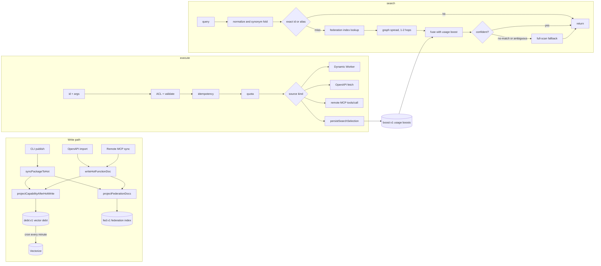

# MCP search, ranking, and execution

How `functhis-mcp` finds a capability for an agent and runs it. This covers the whole pipeline: how the catalog is indexed when something is published or imported, how the `search` tool ranks candidates, how `execute` dispatches a call, and how executions feed back into ranking.

If a term is unfamiliar (`RRF`, `nDCG`, `IDF`, federation, …), skip to [Ranking vocabulary](#ranking-vocabulary) and come back. The rest of this doc uses those words as they appear in the code.

Code lives in two places:

- `apps/mcp/src/` — MCP tool registration (`mcp.ts`), the Worker wiring for search (`search.ts`), the LLM reranker (`search-jev-rerank.ts`), and the execute dispatcher and adapters (`execute-*.ts`).
- `packages/publish/src/` (grouped: `search/`, `federation/`, `sources/`, `catalog/`, `execution/`, `secrets/`, `org/`, `telemetry/`, `auth/`, `http/`) — shared catalog and ranking library: HOT helpers, ranking channels, fusion, graph, embeddings, analytics, and idempotency. MCP wires Vectorize and Jev on top of `searchFunctionsWithContext`.



## What the agent is doing

The MCP surface is two tools, not one tool per function. The agent calls `search` with a natural-language goal (and optional `intents`), gets back a short list of capability ids plus their **contracts**, then calls `execute` with a chosen id and JSON arguments. Search is retrieval for tool use: it has to put a callable contract in the agent's context without listing the whole catalog.

That produces constraints the ranking stack is built around:

- **Exact ids must win.** If the agent already has `@acme/crm/users/search`, do not bury it under a semantic neighbor.
- **Paraphrases must still hit.** `"find customer by mail"` should reach a function whose contract says `"search users by email"`.
- **Silence is better than a wrong winner.** `no_match` (large catalog, nothing nominated) and `ambiguous` (two hits too close to call) are first-class outcomes, not failures.
- **The hot path stays on KV.** Search never reads Postgres. A warm isolate should answer in ~10 ms without embedding the query.
- **Recall must not regress.** The federation index is the fast path. When it is unsure, or when a synonym-only win would hide a better vector hit, the older full-scan hybrid still runs.

## Inspirations

Nothing here is a novel IR invention. The stack is a Worker-shaped composition of ideas that already work in search, recommenders, and agent-tool catalogs.

| Idea | Where it shows up | Why it is here |
| --- | --- | --- |
| Two-tool MCP (`search` then `execute`) | MCP tools, contract-in-hit payload | Same pattern as Kody-style catalogs: the agent discovers, then calls. Functhis `library` is our published functions, not a proxy of other MCP servers. |
| Multi-stage ranking cascade | Index → fusion → optional Jev → fallback hybrid | Web search does cheap retrieval first, expensive models only on an ambiguous shortlist. |
| Inverted index + IDF | `fed:v1:*` postings | Classic information retrieval: rare terms discriminate, common verbs do not. See `IDF` below. |
| Fielded documents | Field weights on id / alias / intent / description / param / body | A match in the capability id is stronger evidence than a match in `searchText`. Same instinct as BM25 on structured fields, without BM25's term-frequency saturation. |
| Static synonym fold | `FEDERATION_SYNONYMS` | Cheap paraphrase (`customer`/`client` → `user`, `mail` → `email`) without waiting on an embedding. |
| Hybrid retrieval | Lexical/index + Vectorize | Sparse matching catches tokens and ids; dense matching catches zero-overlap paraphrases. |
| Reciprocal Rank Fusion (Cormack, Clarke, Buettcher, 2009) | `search-rrf.ts`, `search-fusion.ts` | Channels emit ranks, not comparable scores. RRF is the standard way to merge them without calibrating cosine against token overlap. |
| Spreading activation / co-occurrence graph | Federation adjacency, graph bonus | Capabilities that share a package, action, parameter, or alias are plausible next hops even when the query did not name them. |
| Position-discounted credit (DCG) | Usage boost `1 / log2(position + 1)` | A selection at rank 1 is stronger feedback than a selection at rank 8. Same discount nDCG uses offline. |
| Additive (Laplace) prior | `(selections + 1) / (exposures + 2)` | One lucky click must not dominate a capability that was barely shown. |
| Exponential half-life | 14-day decay on observations | Recent org usage matters more than last quarter. |
| Structured LLM judge | Jev Score questions via OpenRouter Decisions | Rerank by scoring each candidate against a 4-level rubric, not by asking a model to emit a permutation. |
| BGE English embeddings | `@cf/baai/bge-small-en-v1.5` into Vectorize | Small, fast, 384-dim model that Workers AI already hosts. Good enough for recall; not the ranking authority. |

"Federation" in this repo is the **precomputed ranking index** for one org (or the library scope). It is not "call out to other APIs." OpenAPI and remote MCP execution is ordinary HTTP in `execute-http.ts`.

## Capabilities and ids

Everything the agent can call is a **capability** with a stable id `@handle/package/function` (the function slug may contain `/` namespaces). There are three source kinds:

| `sourceKind` | Created by | Executes via |
| --- | --- | --- |
| `hosted_function` | `functhis publish` (CLI) | Dynamic Worker on `functhis-mcp` |
| `openapi_operation` | OpenAPI import (`openapi-sync.ts`) | `fetch` to the spec's `servers[0].url` |
| `remote_mcp_tool` | Remote MCP source sync (`remote-mcp-sync.ts`) | JSON-RPC `tools/call` to the remote MCP endpoint |

All three end up as the same `HotFunctionDoc` in HOT KV, so search and execute treat them uniformly. `sourceReliability` still biases ranking slightly: hosted functions at 1.0, OpenAPI at 0.95, remote MCP at 0.9, anything `degraded` at 0.5. Unreliable sources can still win; they just need a stronger match.

## The HOT catalog (KV)

**HOT** is the Worker-local cache of everything search and execute need on the request path. Search never touches Postgres. It reads only from the `HOT` KV namespace. Keys (`hot-keys.ts`):

| Key | Value |
| --- | --- |
| `fn:v1:@h/p/f` | `HotFunctionDoc` JSON (contract, `searchText`, visibility, owner, org, bundle hash, source metadata). `{}` is a 60 s tombstone for a known miss. |
| `idx:v1:mine:{userId}` | Function ids the user owns |
| `idx:v1:org:{orgId}` | Function ids with `organization` visibility in that org |
| `idx:v1:library` | Function ids with `library` visibility |
| `member:v1:{userId}` | `{ organizationIds }` for ACL |
| `gen:v1:{orgId}` | Catalog generation counter per org (also versions the org federation index) |
| `gen:v1:library` | Generation counter for the library federation index |
| `fed:v1:{scope}:{generation}` | Serialized federation index for one scope (`{orgId}` or `library`): capability table, exact/alias maps, weighted postings, integer graph adjacency. Previous generations are deleted on rebuild. |
| `debt:v1:{capabilityId}`, `debt:v1:pending` | Pending vector embeds |
| `embedfp:v1:{capabilityId}` | Hash of the last embedded text, to skip re-embedding |
| `boost:v1:{orgId}` | Usage boost map `{ capabilityId: boost }` |
| `searchevt:v1:{searchId}` | The search explanation, kept 14 days so `execute` can attribute a selection |
| `mcpsnap:v1:{sourceId}` | Remote MCP `tools/list` snapshot |

A **generation** is a monotonically increasing integer per scope. Readers load `gen:v1:{scope}` then `fed:v1:{scope}:{generation}`. The write path publishes the blob first, then bumps the generation, so a reader never observes a new generation without a blob. Isolates memoize the parsed index and skip the KV read when the generation has not changed.

Execute is different: `resolveHotFunctionDoc` reads `fn:v1:*` first and falls back to Postgres on a miss, then writes the doc back (or a tombstone).

## Write path: indexing a capability

Indexing exists so query time can be a lookup instead of a scan. Publish and import pay the cost once; search reads the result.

### 1. Search text

When a package is published (`http-handlers.ts` finalize), each function gets a `search_text` column built from its contract:

- `buildFunctionSearchText`: slug, `description`, string `examples`, and one line per input/output schema property.
- `buildIntentPhrases` (`search/search-projection.ts`): up to five phrases derived only from the contract — the description plus verb/entity splits of the slug (`users/search` → `search users`, `find user`, …) qualified by the first required parameter (`by email`). Verb variants come from a static table (`search → find/lookup/get`, `create → make/add`, …). Nothing is invented beyond what the contract states.

Those intent phrases are how a query like `"find user by email"` matches a slug `users/search` without an embedding. They are a bounded, contract-faithful query expansion written at index time.

OpenAPI and remote MCP imports build `search_text` with `buildFunctionSearchText` only (description + input schema). They do not add intent phrases.

### 2. HOT docs and domain indexes

`syncPackageToHot` writes one `fn:v1:*` doc per function in the package's current version, then rewrites the domain indexes: it strips the package's old ids and appends the new ones to `idx:v1:mine:{owner}`, plus `idx:v1:org:{org}` for `organization` visibility or `idx:v1:library` for `library` visibility. OpenAPI and MCP imports do the same for the mine and org indexes; imported sources are always `organization` visibility.

The `idx:v1:*` lists are what the **full-scan fallback** walks. The federation blob is what the **hot path** walks. Both are updated on write; they can drift until the next rebuild (see [Known gaps](#known-gaps)).

### 3. Projection (`federation/catalog-projection.ts`, `federation/federation-hot.ts`)

After each doc is written, `projectCapabilityAfterHotWrite` enqueues **vector debt**: `debt:v1:{id}` with `embedText = "<id>\n<searchText>"` (truncated to 2,000 chars) and a per-capability generation, and adds the id to `debt:v1:pending`. Embeddings are deliberately off the publish request: Workers AI latency should not block `functhis publish`.

Once per batch (publish finalize, OpenAPI sync, remote MCP sync), `projectFederationDocs` rebuilds the **federation index** for every touched scope (each org, plus `library` when a library-visible doc changed):

1. Merges the fresh docs into the scope's previous index (or builds from scratch), writes the blob to `fed:v1:{scope}:{generation+1}`, then bumps the scope generation (`gen:v1:{orgId}` or `gen:v1:library`) so readers never observe a new generation without a blob.
2. Deletes the previous generation blob, refreshes the isolate-level memo, and retries on generation races (per-scope serialization plus optimistic retry).

The index is one JSON blob per scope and generation. Under the hood it is four structures that classic search engines keep separately:

- **Capability table**: integer-indexed rows with the search hit payload (`id`, `availability`, trimmed `contract`) plus ACL fields (`organizationId`, `ownerUserId`, `visibility`), source reliability, and `searchText` (so later merges re-index untouched rows with full fidelity). Query-time ACL can run without a second `fn:v1:*` read.
- **Exact map**: lowercased capability id → row; **alias map**: lowercased reviewed alias → rows (per-scope, so an alias in org A can never match org B).
- **Postings**: an inverted index. Each normalized term and two-word phrase maps to `[rowIdx, weight]` with `weight = fieldWeight × IDF × sourceReliability`. Terms come from id segments, description, intent phrases, parameter names, reviewed aliases, and `searchText`, all passed through a static synonym fold (`customer/client → user`, `mail → email`, `remove → delete`). Field weights: id 4, alias 3.5, intent 2.5, description 2, param 1.5, text 1. IDF is `log(1 + N / (1 + df))` — a term in one of fifty functions outranks a term in forty of fifty.
- **Graph adjacency**: integer neighbor lists derived from the authoritative edges (`buildAuthoritativeEdges` plus reviewed aliases): capabilities sharing a package, action (`action:search`), parameter (`param:email`), or alias node link to each other (max 8 neighbors). No per-node KV keys. At query time a hit **spreads** a bonus 1–2 hops: 0.15 at hop 1, 0.05 at hop 2, divided by `log2(degree + 1)` so a hub like `action:get` does not flood the list, then capped at **0.12**.

### 4. Embedding reconcile (cron)

`functhis-mcp` has a `* * * * *` cron. `scheduled` in `apps/mcp/src/index.ts` runs `reconcileSearchIndexDebt` when `CAPABILITY_VECTOR_INDEX` is bound. For each pending id:

1. Compare `sha256(model, dims, fingerprintVersion, text, metadata)` with `embedfp:v1:{id}`. If equal, skip the embed.
2. Otherwise embed with Workers AI `@cf/baai/bge-small-en-v1.5` (384 dims, batches of 8) and upsert into Vectorize with `namespace = organizationId` and `metadata.kind = 'hosted_function'`. Namespacing keeps org A's vectors out of org B's nearest-neighbor results.
3. Clear the debt only if its generation still matches, so a publish that lands mid-reconcile is not lost.

Embedding failures leave the debt in place for the next minute. Vectorize is a **recall** channel, not the source of truth: the federation index answers most queries without it.

## How ranking works (under the hood)

Search does not compute one score. It runs **channels** that each nominate capabilities, then **fuses** those nominations.

### Channels

| Channel | What it measures | Output |
| --- | --- | --- |
| Exact | Query (or alias) is the capability id | Rank 1 on that hit, or the exact-id fast path |
| Lexical / index | Token and phrase overlap after synonym fold | A rank list (`lexicalRank`). On the hot path the underlying score is `indexScore` (postings + graph). |
| Vector | Cosine similarity of query embedding vs stored embeddings | A rank list (`vectorRank`), only on the fallback path (and as a deferral check) |
| Graph | Related capabilities 1–2 hops from lexical seeds | Additive `graphBonus`, cap 0.12 |
| Usage | Org selected this capability after seeing it | Additive `usageBoost`, cap 0.08 |

Raw scores from different channels are not comparable. Token coverage is 0–1 plus a 0.15 phrase bonus. Vector cosine is roughly 0.35–1 after the floor. Postings weights are IDF-scaled and can be large. Adding them would let whichever channel has the bigger numeric range win every time.

**Ranks** are the common currency: 1 is the best hit that channel produced, 2 is the next, and so on. Missing from a channel is not rank 0; it contributes nothing.

### Reciprocal Rank Fusion (RRF)

RRF is the merge. For each capability:

```text
rrfScore =
    1 / (60 + exactRank)          if the exact channel ranked it
  + 1 / (60 + lexicalRank)        if the lexical/index channel ranked it
  + 0.8 / (60 + vectorRank)       if the vector channel ranked it
```

`SEARCH_RRF_K = 60` is the smoothing constant from the original RRF paper. A large `k` means rank 1 is only a little better than rank 2, so a single channel cannot dominate. Rank 1 on lexical is `1/61 ≈ 0.0164`; rank 2 is `1/62 ≈ 0.0161`. Agreement across channels is what jumps the score: exact + lexical both at rank 1 is `≈ 0.033`.

The vector term is weighted **0.8** (`VECTOR_RRF_WEIGHT`) because dense neighbors are useful for paraphrase recall and also eager to promote thematically related but wrong tools. Lexical and exact stay at weight 1.

Then:

```text
fusedScore = rrfScore + graphBonus + usageBoost
```

Graph and usage are **additive caps**, not extra RRF channels. They break ties between comparable hits. They are not supposed to override a clear exact match — and `selectFusedHits` treats `exactRank === 1` as decisive for `no_match` / `ambiguous` regardless of the numeric fused gap.

Worked example, `k = 60`:

| Capability | exactRank | lexicalRank | vectorRank | rrfScore | graphBonus | fusedScore |
| --- | --: | --: | --: | --: | --: | --: |
| `@acme/crm/users/search` | — | 1 | 3 | `1/61 + 0.8/63 ≈ 0.0291` | 0 | 0.0291 |
| `@acme/crm/users/list` | — | 2 | 1 | `1/62 + 0.8/61 ≈ 0.0292` | 0.04 | 0.0692 |
| `@acme/crm/users/get-by-email` | — | 8 | — | `1/68 ≈ 0.0147` | 0.12 | 0.135 |

The third row is a graph neighbor that also received an index rank (hot path: extra graph neighbors sit in the same ordered list, max 8). At the **cap** of 0.12 it sorts above a two-channel RRF of ~0.03; typical hop-1 bonuses are `0.15 / log2(degree + 1)` and shrink on hubs. A graph bonus with **no** RRF channel at all is nominated but cannot pass `selectFusedHits`: `rrfScore` is 0, which is below the 0.01 floor, so the query is `no_match`. Graph is a next-hop bonus on top of a real channel, not a channel of its own.

### Deciding `ok` / `no_match` / `ambiguous`

`selectFusedHits` (`search-fusion.ts`):

- Drop anything not nominated. Keep the top 15 (hard cap 25).
- If the top `rrfScore` is below **0.01** and it is not an exact rank-1, return `no_match`. Weak lexical noise should not become a result set.
- If the second fused score is at least **85%** of the top (`SEARCH_AMBIGUOUS_RATIO`) and neither is an exact winner, mark `ambiguous: true`. The agent should not be told there is a unique best tool.
- Otherwise `reason: ok`.

A small catalog (≤ 25 accessible docs) that would otherwise be `no_match` becomes `browse` on the fallback path: show the catalog and let the agent pick.

## `search` algorithm

Entry point: the MCP `search` tool → `searchFunctions` (`apps/mcp/src/search.ts`) → `searchFunctionsWithContext` (`packages/publish/src/search/search-run.ts`).

Input: `query` (optional), `intents` (optional, up to 5 short verb+object phrasings the agent would use to describe the goal), `domain` = `mine` (default) | `org` | `library`.

Empty query with no intents is not ranked: the fallback loader returns the first 15 accessible docs so a brand-new agent can see _something_.

Target: p95 under 10 ms on a warm isolate, under 50 ms cold, measured inside the worker. The hot path does one generation read per scope (zero KV reads when the isolate memo hits) and no embedding calls. When Vectorize is configured, a synonym-only index win with zero lexical overlap on the index top hit defers to the full-scan fallback so semantic recall is unchanged. Optional Jev rerank can still run on a confident index shortlist when `shouldRerankSearch` applies. `timing.indexMs` includes postings lookup and graph spread (there is no separate `graphMs` field).

### Step 1: Federation index lookup (`federation/federation-index.ts`)

- Resolve scopes: `mine`/`org` → one scope per org in `member:v1:{caller}`; `library` → the `library` scope.
- Load each scope's blob (`loadFederationIndex`): return the isolate-memoized index when the generation matches, else one KV read and parse. `timing.indexMs` covers this step.
- Normalize the query plus each intent (same normalization as the old lexical channel) and fold synonyms. The exact map and alias map are checked against the primary phrasing only.
- Score postings per phrasing (weights already include field weight × IDF × source reliability), keep the best score per capability across phrasings, spread the graph bonus 1–2 hops over the integer adjacency (hop factors 0.15/0.05, degree-normalized, capped at **0.12**), and add up to 8 graph-only neighbors.
- Apply ACL without doc reads: `mine` keeps only `ownerUserId === caller`; otherwise `canAccessPackage` on the indexed metadata (owner always passes; `organization` passes for members; `private` only for the owner).
- **Exact id fast path**: if the query starts with `@` and exactly one accessible hit came from the exact map, verify that single doc from HOT and return it.

Index order becomes `lexicalRank` for fusion (alias hits without a rank get `lexicalRank = 1`, as before), usage boosts come from `boost:v1:{orgId}` read at query time (capped at **0.08**), and rows fuse with the RRF formula above (`vectorRank` absent on this path). `selectFusedHits` decides `ok` / `no_match` / `ambiguous`.

- **Confident** (`ok`, not ambiguous): verify the selected ids against HOT (`loadHotFunctionDocsFromKv`, one parallel batch) to drop tombstoned docs, re-check ACL on loaded docs, then return unless vector deferral applies. The explanation carries the extra `indexScore`. Optional Jev rerank may reorder the verified shortlist (see Step 3).
- **Miss or ambiguous**: fall through to the full-scan fallback below.

**Vector deferral.** The index does not query Vectorize. If the index top hit has **zero** lexical overlap with the query on the full-scan scorer, and Vectorize's top-1 is a _different_ id, the index answer is discarded and fallback runs. That is how `"find customer by mail"` can still retrieve a function whose tokens are `user` / `email` after synonym fold failed to agree with the dense neighbor.

### Step 2: Full-scan fallback (`search/search-fallback.ts`)

The pre-index pipeline, unchanged in behavior: load every accessible `fn:v1:*` doc for the domain, full lexical scan per phrasing (token coverage + phrase boost, top 25), optional vector channel (embed each phrasing, Vectorize topK 100 per org namespace, cosine floor 0.35, 300 ms budgets), RRF fusion, usage boosts, browse when a small catalog (≤ 25) would otherwise be `no_match`, and optional Jev rerank (`shouldRerankSearch`: skips exact winners, pools ≤ 8, and clear winners with `second/top < 0.5`; needs 4 s of the 8 s deadline).

Lexical scoring on this path (`scoreFunctionDocument`) is simpler than postings: fraction of query tokens that appear in `{id, handle, package, slug, searchText}`, plus up to 0.15 if consecutive query bigrams appear as phrases. It is the original Kody-style token coverage. The federation index replaced it on the hot path because scanning every doc does not meet the 10 ms target as catalogs grow.

The fallback guarantees recall never regresses: zero-overlap vector matches still nominate, and Jev still reorders genuinely ambiguous shortlists. It runs only when the index cannot answer confidently, throws, or is deferred.

### Step 3: Jev rerank (`search-ranking.ts`, `apps/mcp/src/search-jev-rerank.ts`)

A second-stage **LLM judge**, not a retrieval channel. It never nominates new ids; it reorders a shortlist that fusion already produced.

It can run on a confident **index** shortlist (`refineIndexOutcomeWithJev`) and on the **fallback** shortlist. `shouldRerankSearch` skips it when:

- the top hit is an exact match,
- the pool is ≤ 8 (not enough ambiguity to spend 4 s),
- or the fused (or lexical) gap is a clear winner (`second/top < 0.5` fused, or a 0.25 lexical gap when fused scores are absent).

The scorer sends each candidate (id, handle, package and function slug, and the first 160 chars of `searchText` on the fallback path) to OpenRouter's Decisions API with `typesafe/jev-1.13` via AI SDK `experimental_evaluate`, in parallel batches of 8. Each candidate gets a 4-level score question: unrelated, tangential, relevant next hop, best primary match. The top 20 (in practice all 15) are reordered by score, keeping fused order on ties.

It falls back to fused order when there is no `OPENROUTER_API_KEY`, any answer is missing, mean confidence is below 0.45, the call throws, or it exceeds the 4 s budget. `timing.jevMs` records the time spent.

On the index path the rerank cards currently pass empty `searchText`; Jev then judges from id and slugs only. Fallback includes the 160-character summary.

### Step 4: Response and analytics

The MCP response is:

```json
{
  "ambiguous": false,
  "reason": "ok",
  "results": [{ "id": "@h/p/f", "availability": "ready", "contract": {} }],
  "searchId": "…",
  "timing": {}
}
```

`reason` is `ok` (ranked hits), `browse` (small catalog, agent should choose), or `no_match` (large catalog, nothing nominated).

`contract` carries `description`, `examples`, `inputSchema`, and `outputSchema`, so the agent can build `execute.arguments` without another call. The result set is trimmed from the bottom until the JSON fits in 24 KiB.

The internal `explanation` (per-hit exact, lexical, and vector ranks, graph bonus, usage boost, fused score, and `indexScore` on the hot path) is not sent to the agent. For non-empty queries it is stored at `searchevt:v1:{searchId}` for 14 days with a SHA-256 of the normalized query and the org's catalog generation. The event is attributed to the first accessible doc's org. `execute` uses that record to credit the selection.

## `execute` algorithm

Entry point: MCP `execute` tool → `executeOwnedFunction` → `dispatchExecute` (`apps/mcp/src/execute-dispatch.ts`).

Input: `id`, `arguments` (object), optional `searchId`, optional `idempotencyKey`.

1. **Parse and size-check.** Invalid ids return `not_found`. The request body (`{ functionSlug, input }`) must be ≤ 1 MiB, otherwise `payload_too_large`.
2. **Resolve and authorize.** Load the doc (HOT, Postgres fallback) and the caller's memberships, and run `canAccessPackage`. Inaccessible and missing capabilities both return `not_found`, so ids are not enumerable.
3. **Availability.** `availability: 'unavailable'` returns 503 `source_unavailable` with `retryable: true`.
4. **Input validation.** `validateContractInput(contract.inputSchema, arguments)`. Failures return 400 `invalid_input` with `issues`, before any quota is spent.
5. **Idempotency** (only with `idempotencyKey`, `idempotency.ts`). Keys are scoped per org in the `execute_idempotency` table. The request hash is `sha256({ arguments, id })`.
   - Same key, different hash → 409 `idempotency_mismatch`.
   - Same key, in progress and updated within the last 35 s (CPU limit 30 s + 5 s grace) → 409 `invocation_in_progress`. Older in-progress records are treated as abandoned and reclaimed.
   - Same key, completed → replay the stored status and body without running anything.
   - Otherwise claim the key as `in_progress`.
6. **Quota.** `reserveOrgExecution` for the org, 429 if the plan quota is exhausted.
7. **Adapter by source kind:**
   - **Hosted function** (`execute-hosted.ts`): load the bundle from `BUNDLES` KV by hash, decrypt the package's secrets, insert a `started` execution row, then run the bundle as a Dynamic Worker through `env.LOADER` with a 30 s CPU limit and 50 subrequests. The runtime module enforces the package host allowlist on outbound `fetch`. An Axiom tail worker is attached when configured, with secret values redacted. `finalizeExecute` writes Analytics Engine and the completed execution row, ingests capped telemetry if the plan retains logs, and maps oversize responses (> 1 MiB) to 413. When the package has `strictOutput`, the response is checked against `outputSchema`; the result is advisory and does not fail the call.
   - **OpenAPI operation** (`execute-http.ts`, `callOpenApiOperation`): interpolate `{param}` placeholders in the path from arguments, check the host is the spec's server host, attach `Authorization: Bearer <credential>` when a credential secret is configured, and `fetch`. Only `GET` retries once, on 429 or 503. Non-GET bodies are the JSON arguments.
   - **Remote MCP tool** (`execute-http.ts`, `callRemoteMcpTool`): POST a JSON-RPC `tools/call` with the tool name and arguments to the source endpoint, with one retry on 429 or 503. Network errors and non-2xx responses invalidate the cached `tools/list` snapshot so the next sync refetches.

   External HTTP adapters record started and completed execution rows as well.

8. **Cancellation.** The inbound request's `AbortSignal` is carried through `AsyncLocalStorage` (`inbound-request-signal.ts`) into the Worker or `fetch`. A client disconnect returns 499 `cancelled`, and the idempotency key is not completed, so a retry with the same key can run again once the record goes stale.
9. **Complete idempotency** with the final status and body.
10. **Selection feedback** (only with `searchId`): `persistSearchSelection`, described below.

The MCP tool returns `{ body, status, timing: { queueMs, upstreamMs, totalMs } }`, with `isError` when status ≥ 400. Validation failures return `{ error, issues, timing }`.

## Feedback loop: search → execute → ranking

When `execute` includes the `searchId` from a prior search, `persistSearchSelection`:

1. Loads `searchevt:v1:{searchId}`. If it expired or never existed, nothing happens.
2. Upserts a `search_event` row: query hash, catalog generation, selected capability, and outcome (`succeeded`, `failed`, or `unavailable`).
3. Inserts `search_exposure` rows once per search: each shown capability, its position, and which channels nominated it. This is the offline dataset for ranking evaluation.
4. Updates the org's usage boost for the selected capability.

The boost formula decays observations with a 14-day half-life and credits selections by position, like DCG:

```text
weight          = 2^(-ageDays / 14)
exposures       = Σ exposures × weight
selections      = Σ (1 / log2(position + 1)) × weight    (selected observations only)
boost           = clamp((selections + 1) / (exposures + 2) - 0.5, 0, 0.08)
```

`1 / log2(position + 1)` is the same discount used in DCG: position 1 credits **1.0**, position 2 about **0.63**, position 3 **0.5**. Showing a capability and not selecting it still counts as exposure, so a frequently shown but ignored tool does not keep climbing.

The `+1 / +2` prior is Laplace smoothing: with no data, `(0+1)/(0+2) = 0.5`, then subtracting 0.5 yields boost 0. A single lucky click cannot dominate. On the live path the update uses one fresh observation and keeps the max of the stored and new value. That produces a boost only for selections at position 1 (0.08 after the cap) or position 2 (about 0.04). The boost is at most 0.08 against RRF scores around 0.01 to 0.05, so it breaks ties between comparable hits rather than overriding relevance. `recomputeOrgBoostMap` can rebuild the map from full observation history, but nothing calls it yet.

## Development and offline behavior

- `isEmbeddingOffline` is true in tests, under `wrangler dev`, and outside production when no Vectorize binding exists. In that mode search skips the vector channel.
- `embedTexts` without an `AI` binding (non-production) returns a deterministic FNV-1a hash embedding so the vector code paths still run. In production a missing `AI` binding throws.
- `MemoryEmbeddingIndex` is an in-memory Vectorize double for tests.
- Without `OPENROUTER_API_KEY` the reranker is a no-op.

## Evaluating ranking

`search-eval.ts` implements recall@10, MRR, nDCG@10, no-match precision (queries that should return nothing do), and p95 latency. These are the same names used in TREC-style IR evaluation; see the glossary for what each number means.

`search-rank-catalog.ts` provides pure lexical and hybrid rankers over an in-memory doc list, and `search-eval-corpus.ts` plus `tests/integration/src/search/eval-corpus.json` hold judged queries (exact id, synonym, zero-overlap, and no-match kinds). `tests/integration/src/search/eval-harness.test.ts` runs the harness. Change a constant, rerun it, and compare the report.

Judged kinds in the corpus:

| Kind | What it tests |
| --- | --- |
| `exact-id` | Pasting `@handle/pkg/fn` returns that id first |
| `synonym` | Folded paraphrase (`customer`/`mail`) still retrieves |
| `zero-overlap` | Query shares no tokens with the doc; only dense retrieval can nominate |
| `no-match` | Ranking must return an empty list, not a confident wrong tool |

Lexical-only vs hybrid is recorded so a fusion or embedding change cannot quietly destroy synonym or zero-overlap recall.

## Ranking vocabulary

Terms as this repo uses them. Formulas match `search-rrf.ts`, `search-fusion.ts`, `search-eval.ts`, and `ranking-boost.ts`.

### Retrieval mechanics

**Channel.** One independent way of scoring the catalog (exact, lexical/index, vector). Channels produce **ranks**, not a shared numeric scale.

**Nominate.** A capability is in the running if at least one channel ranked it, or it received a graph bonus. Un-nominated rows never appear in the result set.

**Rank.** 1-based position in that channel's list. Rank 1 is best. A capability absent from a channel has no rank; its RRF contribution from that channel is 0.

**Score (raw).** Channel-specific number: token coverage, cosine, postings weight. Not compared across channels.

**Fusion.** Combining channel ranks (and additive bonuses) into one ordered list. Here: RRF + graph + usage.

**Hybrid search.** Using both sparse (token / inverted index) and dense (embedding) retrieval, then fusing. The fallback path is hybrid. The hot path is sparse + graph + usage, with vector used only as a deferral check.

**Sparse / lexical.** Matching on tokens. Fast, precise on ids and parameter names, blind to paraphrases that share no words (unless synonym fold or intent phrases introduced those words at index time).

**Dense / vector / embedding.** A model maps text to a 384-dimensional vector. Nearby vectors are semantically similar even with no shared tokens. **Cosine similarity** is the cosine of the angle between two vectors: 1 is identical direction, 0 is orthogonal. Hits below 0.35 are dropped (`SEARCH_VECTOR_MIN_SCORE`).

**Inverted index / postings.** Map from term → list of (document, weight). Query time sums weights for query terms instead of scanning every document. The federation blob is this index plus exact/alias maps and adjacency.

**IDF (inverse document frequency).** `log(1 + N / (1 + df))` in `federation-index.ts`. `N` is the number of capabilities in the scope; `df` is how many of them contain the term. Rare terms get larger weights. `"email"` in two functions outranks `"get"` in forty.

**Field weight.** Multiplier for _where_ the term occurred (id 4 … body text 1). Not IDF. Final posting weight is `fieldWeight × IDF × sourceReliability`.

**Synonym fold.** Rewrite tokens to a canonical form at both index and query time so `"client"` and `"user"` hit the same posting. This is not a thesaurus API; it is a tiny static map.

**Intent phrase.** A short verb+object string either supplied by the agent (`intents`) or derived from the contract at index time (`buildIntentPhrases`). Each phrasing is scored; the best score per capability is kept.

**Graph spread / spreading activation.** Start from the top lexical hits, walk neighbors, add a decaying bonus. Related tools surface as next hops. Degree-normalized so popular actions do not dominate.

**HOT.** KV namespace holding live catalog docs and indexes. Not Postgres. Name means "hot cache," not temperature of the ranking.

**Tombstone.** Empty `{}` at `fn:v1:{id}` for ~60 s after a known miss or delete, so we do not hammer Postgres on a hot id that is gone.

**Generation.** Per-scope integer that versions the federation blob. Readers pin a generation; writers rebuild then increment.

**ACL.** Access control: which capabilities the caller may see. Applied on indexed metadata first, then re-checked on HOT docs after verification.

**Isolate memo.** In-memory copy of a parsed federation index inside a Cloudflare Worker isolate. Valid while `gen:v1:*` is unchanged.

### Fusion and live ranking

**RRF (reciprocal rank fusion).** `score += weight / (k + rank)` per channel, then sort by the sum. Published by Cormack, Clarke, and Buettcher (SIGIR 2009) as a robust way to merge ranked lists without score calibration. `k = 60` here.

**`k` (RRF smoothing).** Added to every rank so the first result is not infinitely better than the second. Larger `k` → flatter channel contributions → more need for channels to _agree_.

**`VECTOR_RRF_WEIGHT` (0.8).** Vector's RRF term is 80% of a lexical/exact term. Dense retrieval is trusted slightly less.

**`SEARCH_NO_MATCH_RRF_FLOOR` (0.01).** Below this RRF (unless exact rank 1), treat the query as unmatched. A lone lexical rank 1 is `1/61 ≈ 0.016`; a lone lexical rank 25 (the lexical cutoff) is `1/85 ≈ 0.012`. Both still pass. Graph-only (`rrfScore = 0`) and a deep vector-only tail (`0.8 / (60 + rank)`) do not.

**`SEARCH_AMBIGUOUS_RATIO` (0.85).** If second/top fused scores ≥ 0.85 and neither is an exact winner, set `ambiguous: true`.

**Usage boost.** Additive 0–0.08 from org click-through, position-discounted and half-life decayed. Tie-breaker, not a third RRF channel.

**Half-life.** 14 days: an observation's weight halves every two weeks (`2^(-ageDays / 14)`).

**Laplace / additive smoothing.** `(successes + 1) / (trials + 2)`. Pretend every capability already had one success and one failure so the posterior starts at 50% and moves slowly.

### Offline evaluation metrics

These numbers are computed against a **judged corpus**: each query has a list of `relevant` capability ids (or none, for `no-match`). They are _not_ computed on live traffic except as we later use `search_exposure` rows.

**Recall@k.** Of all judged-relevant ids, what fraction appear in the top `k` results, ignoring order. `recall@10 = 1` means every relevant id was somewhere in the top 10. High recall with terrible order still scores well; that is why we also track MRR and nDCG.

**MRR (mean reciprocal rank).** For each query, `1 / rank` of the _first_ relevant result (0 if none). Average over queries. Sensitive to putting the right tool first. If the relevant id is 1st, MRR contribution is 1; 2nd is 0.5; 10th is 0.1.

**DCG (discounted cumulative gain).** Sum of `gain / log2(position + 1)` down the list. Gain here is 1 if the id is relevant, else 0. Rank 1 contributes `1/1 = 1`; rank 2 contributes `1/log2(3) ≈ 0.63`; rank 3 contributes `0.5`. Lower ranks are worth less. The usage-boost position credit uses this same discount.

**nDCG@k (normalized DCG).** `DCG@k / IDCG@k`, where IDCG is the DCG of the ideal ranking (all relevant ids first). Result is in `[0, 1]`. **1.0** means the top `k` is a perfect ordering of the judged relevant set; **0** means none of them appeared. `@10` means only the first 10 positions count. Unlike recall, nDCG punishes putting a relevant id at rank 9 instead of rank 1.

**No-match precision.** Of queries judged as `no-match`, the fraction that actually returned an empty list. This is precision on the "return nothing" decision: a ranking that always emits _some_ hit will tank this metric.

**p95 latency.** The 95th percentile of measured search times in the eval run. 95% of queries were faster than this number. Matches the live target of p95 < 10 ms warm.

**Lexical-only baseline.** The same corpus ranked with token coverage and no vector channel. Hybrid should beat it on `synonym` and `zero-overlap` without collapsing `no-match` precision.

## Constants

All in `packages/publish/src/search/search-result.ts` unless noted.

| Constant | Value | Meaning |
| --- | --- | --- |
| `SEARCH_RRF_K` (`search-rrf.ts`) | 60 | RRF smoothing `k` |
| `VECTOR_RRF_WEIGHT` | 0.8 | Vector channel weight in RRF |
| `SEARCH_LEXICAL_TOP` | 25 | Lexical candidates kept |
| `SEARCH_VECTOR_TOP_K` | 100 | Vectorize topK per namespace |
| `SEARCH_VECTOR_MIN_SCORE` | 0.35 | Cosine floor |
| `SEARCH_GRAPH_SEED` / `SEARCH_GRAPH_NEIGHBORS` | 10 / 8 | Graph seeds and max graph-only additions |
| `GRAPH_BONUS_CAP` / `USAGE_BOOST_CAP` | 0.12 / 0.08 | Additive caps |
| `SEARCH_NO_MATCH_RRF_FLOOR` | 0.01 | Below this RRF, `no_match` unless exact rank 1 |
| `SEARCH_AMBIGUOUS_RATIO` | 0.85 | Second/top fused ratio for `ambiguous` |
| `SEARCH_DEFAULT_LIMIT` / `SEARCH_HARD_LIMIT` | 15 / 25 | Result limits |
| `SEARCH_PAYLOAD_MAX_BYTES` | 24 KiB | Response trim budget |
| `SEARCH_DEADLINE_MS` | 8000 | Whole-search budget |
| `SEARCH_VECTOR_BUDGET_MS` / `SEARCH_JEV_BUDGET_MS` | 300 / 4000 | Fallback channel timeouts |
| `RERANK_SKIP_POOL_SIZE` / `RERANK_POOL_MAX` (`search-ranking.ts`) | 8 / 20 | Rerank pool bounds |
| `CLEAR_WINNER_FUSED_RATIO` (`search-ranking.ts`) | 0.5 | Skip rerank below this second/top ratio |
| `jevSearchMinMeanConfidence` (`search-jev-rerank.ts`) | 0.45 | Discard rerank below this confidence |
| `USAGE_HALF_LIFE_DAYS` (`ranking-boost.ts`) | 14 | Usage decay |
| `EXECUTE_CPU_MS` / `EXECUTE_SUB_REQUESTS` (`constants.ts`) | 30000 / 50 | Dynamic Worker limits |
| `MAX_EXECUTE_REQUEST_BYTES` / `MAX_EXECUTE_RESPONSE_BYTES` (`constants.ts`) | 1 MiB / 1 MiB | Execute payload limits |

## Known gaps

These are current behaviors worth knowing before changing the pipeline:

- **Library domain is owner-only.** `canAccessPackage` denies `library` visibility to non-owners, so `domain: library` returns only the caller's own library packages.
- **Tombstoned docs linger in the index.** Deletions are verified at query time (top hits are re-read from HOT), so a removed capability can briefly stay in the blob until the next rebuild of its scope.
- **Pending debt and index lists are read-modify-write in KV.** Concurrent publishes can drop an id from `debt:v1:pending` or a domain index. The next publish of that package repairs it.
- **Idempotency is claimed before the quota check.** A 429 leaves the key `in_progress` until the 35 s stale window passes.
- **Index-path Jev sees empty `searchText`.** Fallback rerank includes a 160-character summary; the index-path adapter currently does not.
