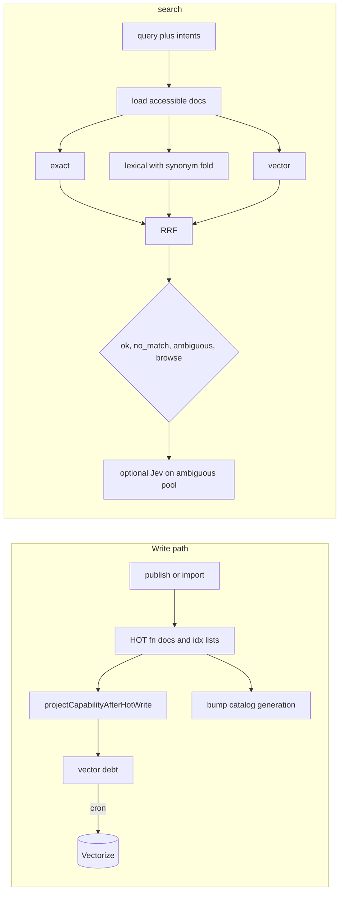

# MCP search, ranking, and execution

How `functhis-mcp` finds a capability for an agent and runs it. This covers indexing on publish/import, the `search` tool, the `execute` tool, and how selections are logged for offline evaluation.

If a term is unfamiliar (`RRF`, `nDCG`, …), skip to [Ranking vocabulary](#ranking-vocabulary) and come back.

Code lives in two places:

- `apps/mcp/src/` — MCP tools (`mcp.ts`), search wiring (`search.ts`), execute dispatch.
- Jev rerank scorer lives in `packages/publish/src/search/search-jev-rerank.ts` (MCP imports it when OpenRouter is configured).
- `packages/publish/src/` — HOT catalog, search (`search/`), embeddings, Vectorize debt, analytics, execution adapters.



## What the agent is doing

The MCP surface is two tools. The agent calls `search` with a natural-language goal (and optional `intents`), gets capability ids plus **contracts**, then calls `execute` with a chosen id and JSON arguments.

Constraints the ranking stack is built around:

- **Exact ids must win.** `@acme/crm/users/search` must not lose to a semantic neighbor.
- **Paraphrases must still hit.** Hybrid retrieval (lexical + Vectorize) plus synonym fold handles most cases; Jev breaks ties on ambiguous shortlists.
- **Silence beats a wrong winner.** `no_match` and `ambiguous` are first-class outcomes.
- **Search stays on KV.** Postgres is not queried on the search path.

## Inspirations (short)

| Idea | Where | Why |
| --- | --- | --- |
| Two-tool MCP | `search` then `execute` | Discover, then call with a contract in context. |
| Multi-stage cascade | RRF fusion → optional Jev | Cheap channels first; LLM judge only when fusion is unsure. |
| Static synonym fold | `SEARCH_SYNONYMS` in `search-lexical.ts` | `customer`/`client` → `user`, `mail` → `email` without an embedding call. |
| Hybrid retrieval | Lexical scan + Vectorize | Tokens and ids vs dense paraphrase recall. |
| RRF (Cormack et al., 2009) | `search-rrf.ts`, `search-fusion.ts` | Merge ranked lists without calibrating scores across channels. |
| BGE small English | `@cf/baai/bge-small-en-v1.5` | 384-dim embeddings on Workers AI into Vectorize. |
| Jev Score judge | OpenRouter Decisions + `typesafe/jev-1.13` | Structured rubric rerank, not free-form reordering. |

## Capabilities and ids

Stable id: `@handle/package/function`. Source kinds: `hosted_function`, `openapi_operation`, `remote_mcp_tool`. All become `HotFunctionDoc` in HOT KV.

## HOT catalog (KV)

Search reads only `HOT` KV (`hot-keys.ts`):

| Key | Value |
| --- | --- |
| `fn:v1:@h/p/f` | `HotFunctionDoc` JSON |
| `idx:v1:mine:{userId}` | Owned function ids |
| `idx:v1:org:{orgId}` | Org-visible ids |
| `idx:v1:library` | Library-visible ids |
| `member:v1:{userId}` | `{ organizationIds }` for ACL |
| `gen:v1:{orgId}` | Per-org catalog generation (versions `search_event.catalog_generation`) |
| `debt:v1:*`, `embedfp:v1:*` | Vector embedding debt and fingerprints |
| `searchevt:v1:{searchId}` | Explanation blob (14 days) |

Execute may fall back to Postgres on a HOT miss, then backfill HOT.

## Write path

### Search text

Publish finalize builds `searchText` from slug, description, examples, and schema property names. Hosted functions also get **intent phrases** (`buildIntentPhrases` in `search-projection.ts`) derived from slug verbs and the first required parameter. OpenAPI and remote MCP imports use description + input schema only.

### HOT docs and indexes

`syncPackageToHot` (and import paths) write `fn:v1:*` and rewrite domain index lists for the package version.

### Projection (`catalog/hot-search-projection.ts`)

After each doc write, `projectCapabilityAfterHotWrite` enqueues vector debt. Batch writes call `bumpCatalogGenerationsForDocs` once per touched org. Embeddings are off the publish hot path.

### Embedding reconcile

MCP cron runs `reconcileSearchIndexDebt` when Vectorize is bound. Workers AI embeds in batches of 8; invalid rows throw so debt retries. Query-time embeddings use the same model via the `AI` binding (or REST in the live eval script).

## How ranking works

Search runs **channels**, then **fuses** with RRF.

| Channel | Output |
| --- | --- |
| Exact | Capability id match |
| Lexical | Token coverage + phrase boost on `{id, handle, package, slug, searchText}` with `SEARCH_SYNONYMS` on query and document tokens |
| Vector | Cosine similarity after embedding all query phrasings in one Workers AI call |

```text
rrfScore =
    1 / (60 + exactRank)
  + 1 / (60 + lexicalRank)
  + 1 / (60 + vectorRank)     // VECTOR_RRF_WEIGHT = 1
fusedScore = rrfScore
```

`selectFusedHits` applies `SEARCH_NO_MATCH_RRF_FLOOR`, `SEARCH_AMBIGUOUS_RATIO`, and exact rank-1 rules. Small catalogs (≤ 25 docs) may get `browse` instead of `no_match`.

## `search` algorithm

`searchFunctions` (`apps/mcp/src/search.ts`) → `searchFunctionsWithContext` (`search/search-run.ts`).

1. **Load** every accessible `fn:v1:*` for the domain (one KV read per id today — see [Known gaps](#known-gaps)).
2. **Exact** id fast path when the query is a single `@…` id.
3. **Lexical** scan per phrasing (query + up to five `intents`), keep top 25.
4. **Vector** (when Vectorize + embed are configured): embed all phrasings in one batch, topK per org namespace, cosine floor 0.35, budget 1500 ms (warn on timeout).
5. **RRF fusion** and outcome selection.
6. **Jev rerank** when `shouldRerankSearch`: at least two candidates, top is not exact, and not a clear fused winner (`second/top ≥ 0.5`). Rerank cards use contract description plus input parameter names (~400 chars), built in `search-rerank.ts`. Falls back on missing key, low confidence, errors, or 4 s budget.

Empty query with no intents returns the first 15 accessible docs.

## `execute` and feedback

`execute` resolves the doc, validates input, idempotency, quota, then dispatches by source kind. With `searchId`, `persistSearchSelection` writes `search_event` and `search_exposure` rows (`graphChannel: false`). Usage-based KV boosts were removed; exposure rows remain the offline evaluation dataset.

## Development and offline behavior

- Tests and local dev skip live Vectorize unless a binding is present (`isEmbeddingOffline`).
- Without `AI`, non-production `embedTexts` uses deterministic FNV embeddings for unit tests only; production throws on bad Workers AI rows.
- Without `OPENROUTER_API_KEY`, Jev is a no-op.

## Evaluating ranking

`search-eval.ts` implements recall@10, MRR, nDCG@10, no-match precision, and p95 latency.

- **CI harness:** `tests/integration/src/search/eval-corpus.json` (34 functions, 27 judged queries) and `eval-harness.test.ts` seed HOT and call `searchFunctionsWithContext` (lexical path, Jev disabled). Floors: no-match precision 1.0, exact-id recall@10 1.0, lexical recall@10 ≥ 0.70 on non-paraphrase, non-zero-overlap queries.
- **Live eval (opt-in):** `bun run eval:search:live` with `CLOUDFLARE_ACCOUNT_ID`, `CLOUDFLARE_API_TOKEN`, and optionally `OPENROUTER_API_KEY`. Uses real Workers AI embeddings and compares lexical, hybrid, and hybrid+Jev (`tests/integration/scripts/search-eval-live.ts`).

Judged query kinds: `direct-overlap`, `synonym`, `zero-overlap`, `paraphrase`, `exact-id`, `no-match`.

## Ranking vocabulary

**Channel / rank / fusion** — same as before: channels emit ranks; RRF merges them.

**Hybrid search** — lexical scan plus Vectorize on the same loaded doc set.

**Synonym fold** — static map in `SEARCH_SYNONYMS`, applied inside `scoreFunctionDocument`.

**Cosine floor** — `SEARCH_VECTOR_MIN_SCORE` (0.35).

**RRF** — `score += weight / (k + rank)` with `k = 60`.

**Recall@k, MRR, nDCG@k, no-match precision, p95** — standard IR metrics; see prior definitions in git history if you need the long form.

## Constants

| Constant | Value | Meaning |
| --- | --- | --- |
| `SEARCH_RRF_K` | 60 | RRF smoothing |
| `VECTOR_RRF_WEIGHT` | 1 | Vector channel weight |
| `SEARCH_LEXICAL_TOP` | 25 | Lexical cutoff |
| `SEARCH_VECTOR_TOP_K` | 100 | Vectorize topK |
| `SEARCH_VECTOR_MIN_SCORE` | 0.35 | Cosine floor |
| `SEARCH_VECTOR_BUDGET_MS` | 1500 | Vector channel timeout |
| `SEARCH_JEV_BUDGET_MS` | 4000 | Jev timeout |
| `SEARCH_NO_MATCH_RRF_FLOOR` | 0.01 | Weak-match floor |
| `SEARCH_AMBIGUOUS_RATIO` | 0.85 | Ambiguous second/top |
| `CLEAR_WINNER_FUSED_RATIO` | 0.5 | Skip Jev below this |
| `SEARCH_DEFAULT_LIMIT` / `SEARCH_HARD_LIMIT` | 15 / 25 | Result caps |
| `SEARCH_DEADLINE_MS` | 8000 | Whole search budget |

## Known gaps

- **Library domain is owner-only** for non-owners (`canAccessPackage`).
- **One KV read per accessible function** on search. Cloudflare caps KV ops per invocation; very large org catalogs will need a per-org snapshot blob later.
- **Vectorize namespace fan-out** is capped at `SEARCH_VECTOR_MAX_NAMESPACES` (8) per search, preferring orgs with the most loaded docs. Library search across many orgs may miss vector hits outside those namespaces until a shared library namespace exists.
- **Tombstoned docs** may linger in index lists until the next package rewrite; top hits are re-verified from HOT.
- **Pending debt and index lists** are read-modify-write; concurrent publishes can race (repaired on next publish).
- **Idempotency is claimed before quota**; 429 leaves keys stale until timeout.
