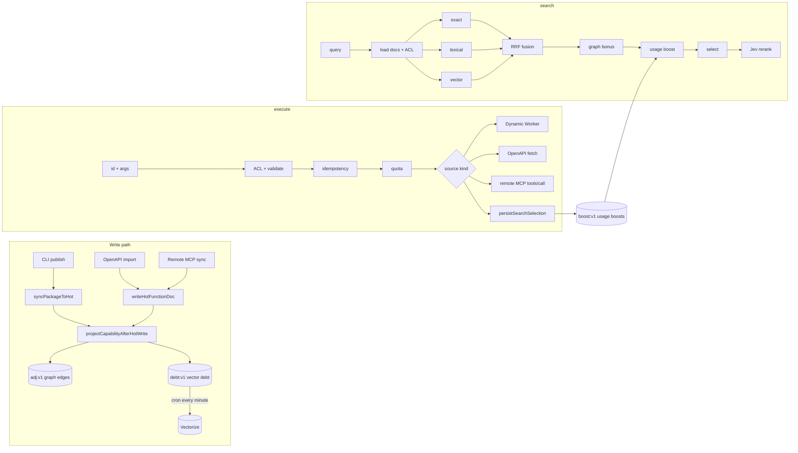

# MCP search, ranking, and execution

How `functhis-mcp` finds a capability for an agent and runs it. This covers the whole pipeline: how the catalog is indexed when something is published or imported, how the `search` tool ranks candidates, how `execute` dispatches a call, and how executions feed back into ranking.

Code lives in two places:

- `apps/mcp/src/` — MCP tool registration (`mcp.ts`), the Worker wiring for search (`search.ts`), the LLM reranker (`search-jev-rerank.ts`), and the execute dispatcher and adapters (`execute-*.ts`).
- `packages/publish/src/` (grouped: `search/`, `federation/`, `sources/`, `catalog/`, `execution/`, `secrets/`, `org/`, `telemetry/`, `auth/`, `http/`) — shared catalog and ranking library: HOT helpers, ranking channels, fusion, graph, embeddings, analytics, and idempotency. MCP wires Vectorize and Jev on top of `searchFunctionsWithContext`.



## Capabilities and ids

Everything the agent can call is a **capability** with a stable id `@handle/package/function` (the function slug may contain `/` namespaces). There are three source kinds:

| `sourceKind` | Created by | Executes via |
| --- | --- | --- |
| `hosted_function` | `functhis publish` (CLI) | Dynamic Worker on `functhis-mcp` |
| `openapi_operation` | OpenAPI import (`openapi-sync.ts`) | `fetch` to the spec's `servers[0].url` |
| `remote_mcp_tool` | Remote MCP source sync (`remote-mcp-sync.ts`) | JSON-RPC `tools/call` to the remote MCP endpoint |

All three end up as the same `HotFunctionDoc` in HOT KV, so search and execute treat them uniformly.

## The HOT catalog (KV)

Search never touches Postgres. It reads only from the `HOT` KV namespace. Keys (`hot-keys.ts`):

| Key | Value |
| --- | --- |
| `fn:v1:@h/p/f` | `HotFunctionDoc` JSON (contract, `searchText`, visibility, owner, org, bundle hash, source metadata). `{}` is a 60 s tombstone for a known miss. |
| `idx:v1:mine:{userId}` | Function ids the user owns |
| `idx:v1:org:{orgId}` | Function ids with `organization` visibility in that org |
| `idx:v1:library` | Function ids with `library` visibility |
| `member:v1:{userId}` | `{ organizationIds }` for ACL |
| `adj:v1:{nodeId}` | Outgoing graph edges from a node |
| `gen:v1:{orgId}` | Catalog generation counter per org |
| `debt:v1:{capabilityId}`, `debt:v1:pending` | Pending vector embeds |
| `embedfp:v1:{capabilityId}` | Hash of the last embedded text, to skip re-embedding |
| `boost:v1:{orgId}` | Usage boost map `{ capabilityId: boost }` |
| `searchevt:v1:{searchId}` | The search explanation, kept 14 days so `execute` can attribute a selection |
| `mcpsnap:v1:{sourceId}` | Remote MCP `tools/list` snapshot |

Execute is different: `resolveHotFunctionDoc` reads `fn:v1:*` first and falls back to Postgres on a miss, then writes the doc back (or a tombstone).

## Write path: indexing a capability

### 1. Search text

When a package is published (`http-handlers.ts` finalize), each function gets a `search_text` column built from its contract:

- `buildFunctionSearchText`: slug, `description`, string `examples`, and one line per input/output schema property.
- `buildIntentPhrases` (`search-projection.ts`): up to five phrases of the form `"<description> <param>"`, using required params first and falling back to all params. With no description it emits `"<slug> <params…>"`.

OpenAPI and remote MCP imports build `search_text` with `buildFunctionSearchText` only (description + input schema). They do not add intent phrases.

### 2. HOT docs and domain indexes

`syncPackageToHot` writes one `fn:v1:*` doc per function in the package's current version, then rewrites the domain indexes: it strips the package's old ids and appends the new ones to `idx:v1:mine:{owner}`, plus `idx:v1:org:{org}` for `organization` visibility or `idx:v1:library` for `library` visibility. OpenAPI and MCP imports do the same for the mine and org indexes; imported sources are always `organization` visibility.

### 3. Projection (`catalog-projection.ts`)

After each doc is written, `projectCapabilityAfterHotWrite`:

1. Bumps `gen:v1:{orgId}`.
2. Writes **authoritative graph edges** (`buildAuthoritativeEdges`): `@handle → @handle/pkg` (`org_owns_package`), `@handle/pkg → capability` (`package_contains`), namespace → capability, capability → `action:<last segment>`, capability → `param:<name>` per input property, capability → `source:<kind>`, and `secret:<name> → capability`.
3. Writes a `reviewed_alias` edge `alias:<word> → capability` for every string in `contract.reviewedAliases`.
4. Enqueues **vector debt**: `debt:v1:{id}` with `embedText = "<id>\n<searchText>"` (truncated to 2,000 chars) and a per-capability generation, and adds the id to `debt:v1:pending`.

### 4. Embedding reconcile (cron)

`functhis-mcp` has a `* * * * *` cron. `scheduled` in `apps/mcp/src/index.ts` runs `reconcileSearchIndexDebt` when `CAPABILITY_VECTOR_INDEX` is bound. For each pending id:

1. Compare `sha256(model, dims, fingerprintVersion, text, metadata)` with `embedfp:v1:{id}`. If equal, skip the embed.
2. Otherwise embed with Workers AI `@cf/baai/bge-small-en-v1.5` (384 dims, batches of 8) and upsert into Vectorize with `namespace = organizationId` and `metadata.kind = 'hosted_function'`.
3. Clear the debt only if its generation still matches, so a publish that lands mid-reconcile is not lost.

Embedding failures leave the debt in place for the next minute.

## `search` algorithm

Entry point: the MCP `search` tool → `searchFunctions` (`apps/mcp/src/search.ts`) → `searchFunctionsWithContext` (`packages/publish/src/search/search-run.ts`).

Input: `query` (optional), `intents` (optional, up to 5 short verb+object phrasings the agent would use to describe the goal), `domain` = `mine` (default) | `org` | `library`. Lexical and vector channels run for the primary `query` plus each intent; the best rank per capability across phrasings is kept. Exact match and graph `alias:` seeds use only the primary `query` (or the first intent when `query` is empty).

### Step 1: Load candidates and apply ACL

- Read the domain index: `mine` → `idx:v1:mine:{caller}`; `library` → `idx:v1:library`; `org` → union of `idx:v1:org:{orgId}` for every org in `member:v1:{caller}`.
- Load every `fn:v1:*` doc for those ids.
- Filter with `canAccessPackage`: the owner always passes; `organization` visibility passes for members of that org; `private` passes only for the owner. There is no branch for `library` visibility, so today a library package is visible only to its owner (covered by `catalog-access.test.ts`).

Every later step only ranks this accessible set. `timing.loadMs` covers this step.

### Step 2: Short-circuits

- **Empty query**: return the first 15 docs in index order, `reason: 'ok'` (or `no_match` if none).
- **Exact id**: if the query starts with `@`, equals an accessible id, and exactly one doc matches exactly, return that single hit.

### Step 3: Three retrieval channels

Each channel produces a **rank** (1 = best) per capability id. Channels never compare raw scores with each other.

**Exact channel** (`search-exact.ts`). A doc matches if the trimmed, lowercased query equals its function slug, package slug, handle, or full `@h/p/f` id. Matching docs get ranks 1, 2, … in catalog order.

**Lexical channel** (`search-lexical.ts`, `scoreFunctionDocument`). For each search phrasing (`query` + `intents`), the document text is `id + handle + packageSlug + functionSlug + searchText`.

1. Normalize: NFKD, strip diacritics, split camelCase, turn `_ . / : -` into spaces, lowercase.
2. Query tokens: alphanumeric runs of length ≥ 2, with stopwords removed (`a, an, and, for, from, i, in, into, is, me, my, of, on, or, please, the, to, with`), deduplicated. If that leaves nothing, the raw query is used.
3. Score = **token coverage** + **phrase boost**:
   - coverage = (query tokens found in the doc) / (query tokens)
   - phrase boost = 0.15 × (adjacent query-token bigrams that appear verbatim in the normalized doc) / (bigrams)
4. Keep docs with score > 0, sort descending, take the top 25. Rank = position. The lexical rank for fusion is the **best** (lowest) rank any phrasing achieved for that id.

**Vector channel** (only when `CAPABILITY_VECTOR_INDEX` is bound).

1. Embed each phrasing with the same Workers AI model, with a shared 300 ms budget for the batch.
2. Query Vectorize with `topK = 100` in each org namespace present in the accessible docs, each with a 300 ms budget.
3. Merge matches by cosine score, drop ids that are not in the accessible set, drop scores below **0.35**, deduplicate. Rank = position. As with lexical, the vector rank for fusion is the best rank across phrasings.

Timeouts or errors produce an empty vector channel, not a failed search.

### Step 4: Reciprocal Rank Fusion (`search-rrf.ts`, `search-fusion.ts`)

Every id nominated by at least one channel gets:

```text
rrfScore = 1/(60 + exactRank) + 1/(60 + lexicalRank) + 0.8/(60 + vectorRank)
```

A missing rank contributes 0. `k = 60` flattens the curve so being first in one channel does not dominate being near the top of two. Vector is weighted 0.8 because embeddings are the least precise channel.

Example: a doc that is lexical #1 and vector #3 scores `1/61 + 0.8/63 ≈ 0.0291`. A doc that is only lexical #1 scores `1/61 ≈ 0.0164`.

### Step 5: Graph bonus (`capability-graph.ts`, `graph-hot.ts`)

Seeds are the top 10 fused ids plus `alias:<token>` for each query token (lowercased, split on non-alphanumerics, length > 1). Load `adj:v1:{seed}` for every seed within a 100 ms budget.

`traverseGraphNeighbors` walks outgoing edges (at most 8 per node, at most 2 hops). Only edges whose target is an accessible capability or a seed count. Authoritative edges can nominate new candidates; inferred edges (`similar_to`, `co_used`) only add bonus to nodes the walk already reached. The bonus per edge is:

```text
weight × confidence × sourceReliability × hopFactor / log2(outDegree + 1)
hopFactor = 0.15 at hop 1, 0.05 at hop 2
```

Bonuses sum per target, seeds get none, and the total is capped at **0.12**. Up to 8 graph-only ids are added to the candidate set. A capability reached from an `alias:<token>` seed via `reviewed_alias` also gets `lexicalRank = 1` if it had no lexical rank, so reviewed aliases behave like a top lexical hit.

In practice the main graph signal today is reviewed aliases. Capability → `param:` / `action:` / `source:` edges point at nodes that are not capabilities, so they do not score, and only seed adjacency is loaded from KV, so second-hop edges are never present.

### Step 6: Usage boost (`ranking-boost.ts`)

Read `boost:v1:{orgId}` for every org in the accessible set, merge the maps, and add the boost (capped at **0.08**) for each candidate.

```text
fusedScore = rrfScore + graphBonus + usageBoost
```

Rows are sorted by `fusedScore` descending, ties broken by id.

### Step 7: Selection (`selectFusedHits`)

- Keep nominated rows (exact, lexical, vector, or graph bonus > 0), and take at most 15 (hard limit 25).
- **No match**: if there is no row, or the top row's `rrfScore < 0.01` and it is not exact rank 1, return `reason: 'no_match'` with no results when the accessible catalog has more than **25** capabilities. The floor is roughly "a single mid-ranked vector hit and nothing else" (`0.8/(60+20) = 0.01`).
- **Browse**: when selection would be `no_match` but the caller can access **25 or fewer** capabilities, return all of them (up to 15) with `reason: 'browse'` and zero fused scores so the agent can read contracts and pick the right capability (common for early catalogs and paraphrase queries like "user wants to say hi" against a bare `hello-world` slug).
- **Ambiguous**: `true` when neither of the top two is exact rank 1 and `second.fusedScore / top.fusedScore ≥ 0.85`. The agent should inspect several hits instead of blindly executing the first.

### Step 8: Jev rerank (`search-ranking.ts`, `apps/mcp/src/search-jev-rerank.ts`)

`shouldRerankSearch` decides whether an LLM second opinion is worth the latency. It skips when:

- the top hit is an exact match,
- there are 8 or fewer candidates, or
- the top is a clear winner: `second.fusedScore / top.fusedScore < 0.5`.

Selection caps candidates at 15, so rerank runs only for 9 to 15 candidates. It also requires at least 4 s left of the 8 s search deadline and a configured scorer.

The scorer sends each candidate (id, handle, package and function slug, and the first 160 chars of `searchText`) to OpenRouter's Decisions API with `typesafe/jev-1.13` via AI SDK `experimental_evaluate`, in parallel batches of 8. Each candidate gets a 4-level score question: unrelated, tangential, relevant next hop, best primary match. The top 20 (in practice all 15) are reordered by score, keeping fused order on ties.

It falls back to fused order when there is no `OPENROUTER_API_KEY`, any answer is missing, mean confidence is below 0.45, the call throws, or it exceeds the 4 s budget. `timing.jevMs` records the time spent.

### Step 9: Response and analytics

The MCP response is:

```json
{
  "ambiguous": false,
  "reason": "ok",
  "results": [{ "id": "@h/p/f", "availability": "ready", "contract": {} }],
  "searchId": "…",
  "timing": {}
}
```

`reason` is `ok` (ranked hits), `browse` (small catalog, agent should choose), or `no_match` (large catalog, nothing nominated).

`contract` carries `description`, `examples`, `inputSchema`, and `outputSchema`, so the agent can build `execute.arguments` without another call. The result set is trimmed from the bottom until the JSON fits in 24 KiB.

The internal `explanation` (per-hit exact, lexical, and vector ranks, graph bonus, usage boost, fused score) is not sent to the agent. For non-empty queries it is stored at `searchevt:v1:{searchId}` for 14 days with a SHA-256 of the normalized query and the org's catalog generation. The event is attributed to the first accessible doc's org.

## `execute` algorithm

Entry point: MCP `execute` tool → `executeOwnedFunction` → `dispatchExecute` (`apps/mcp/src/execute-dispatch.ts`).

Input: `id`, `arguments` (object), optional `searchId`, optional `idempotencyKey`.

1. **Parse and size-check.** Invalid ids return `not_found`. The request body (`{ functionSlug, input }`) must be ≤ 1 MiB, otherwise `payload_too_large`.
2. **Resolve and authorize.** Load the doc (HOT, Postgres fallback) and the caller's memberships, and run `canAccessPackage`. Inaccessible and missing capabilities both return `not_found`, so ids are not enumerable.
3. **Availability.** `availability: 'unavailable'` returns 503 `source_unavailable` with `retryable: true`.
4. **Input validation.** `validateContractInput(contract.inputSchema, arguments)`. Failures return 400 `invalid_input` with `issues`, before any quota is spent.
5. **Idempotency** (only with `idempotencyKey`, `idempotency.ts`). Keys are scoped per org in the `execute_idempotency` table. The request hash is `sha256({ arguments, id })`.
   - Same key, different hash → 409 `idempotency_mismatch`.
   - Same key, in progress and updated within the last 35 s (CPU limit 30 s + 5 s grace) → 409 `invocation_in_progress`. Older in-progress records are treated as abandoned and reclaimed.
   - Same key, completed → replay the stored status and body without running anything.
   - Otherwise claim the key as `in_progress`.
6. **Quota.** `reserveOrgExecution` for the org, 429 if the plan quota is exhausted.
7. **Adapter by source kind:**
   - **Hosted function** (`execute-hosted.ts`): load the bundle from `BUNDLES` KV by hash, decrypt the package's secrets, insert a `started` execution row, then run the bundle as a Dynamic Worker through `env.LOADER` with a 30 s CPU limit and 50 subrequests. The runtime module enforces the package host allowlist on outbound `fetch`. An Axiom tail worker is attached when configured, with secret values redacted. `finalizeExecute` writes Analytics Engine and the completed execution row, ingests capped telemetry if the plan retains logs, and maps oversize responses (> 1 MiB) to 413. When the package has `strictOutput`, the response is checked against `outputSchema`; the result is advisory and does not fail the call.
   - **OpenAPI operation** (`execute-http.ts`, `callOpenApiOperation`): interpolate `{param}` placeholders in the path from arguments, check the host is the spec's server host, attach `Authorization: Bearer <credential>` when a credential secret is configured, and `fetch`. Only `GET` retries once, on 429 or 503. Non-GET bodies are the JSON arguments.
   - **Remote MCP tool** (`execute-http.ts`, `callRemoteMcpTool`): POST a JSON-RPC `tools/call` with the tool name and arguments to the source endpoint, with one retry on 429 or 503. Network errors and non-2xx responses invalidate the cached `tools/list` snapshot so the next sync refetches.

   External HTTP adapters record started and completed execution rows as well. "Federation" in this repo means the precomputed search ranking index, not external API calling.

8. **Cancellation.** The inbound request's `AbortSignal` is carried through `AsyncLocalStorage` (`inbound-request-signal.ts`) into the Worker or `fetch`. A client disconnect returns 499 `cancelled`, and the idempotency key is not completed, so a retry with the same key can run again once the record goes stale.
9. **Complete idempotency** with the final status and body.
10. **Selection feedback** (only with `searchId`): `persistSearchSelection`, described below.

The MCP tool returns `{ body, status, timing: { queueMs, upstreamMs, totalMs } }`, with `isError` when status ≥ 400. Validation failures return `{ error, issues, timing }`.

## Feedback loop: search → execute → ranking

When `execute` includes the `searchId` from a prior search, `persistSearchSelection`:

1. Loads `searchevt:v1:{searchId}`. If it expired or never existed, nothing happens.
2. Upserts a `search_event` row: query hash, catalog generation, selected capability, and outcome (`succeeded`, `failed`, or `unavailable`).
3. Inserts `search_exposure` rows once per search: each shown capability, its position, and which channels nominated it. This is the offline dataset for ranking evaluation.
4. Updates the org's usage boost for the selected capability.

The boost formula decays observations with a 14-day half-life and credits selections by position, like DCG:

```text
weight          = 2^(-ageDays / 14)
exposures       = Σ exposures × weight
selections      = Σ (1 / log2(position + 1)) × weight    (selected observations only)
boost           = clamp((selections + 1) / (exposures + 2) - 0.5, 0, 0.08)
```

The `+1 / +2` prior starts every capability at 0.5 expected selection rate, so a single lucky click cannot dominate. On the live path the update uses one fresh observation and keeps the max of the stored and new value. That produces a boost only for selections at position 1 (0.08 after the cap) or position 2 (about 0.04). The boost is at most 0.08 against RRF scores around 0.01 to 0.05, so it breaks ties between comparable hits rather than overriding relevance. `recomputeOrgBoostMap` can rebuild the map from full observation history, but nothing calls it yet.

## Development and offline behavior

- `isEmbeddingOffline` is true in tests, under `wrangler dev`, and outside production when no Vectorize binding exists. In that mode search skips the vector channel.
- `embedTexts` without an `AI` binding (non-production) returns a deterministic FNV-1a hash embedding so the vector code paths still run. In production a missing `AI` binding throws.
- `MemoryEmbeddingIndex` is an in-memory Vectorize double for tests.
- Without `OPENROUTER_API_KEY` the reranker is a no-op.

## Evaluating ranking

`search-eval.ts` implements recall@10, MRR, nDCG@10, no-match precision (queries that should return nothing do), and p95 latency. `search-rank-catalog.ts` provides pure lexical and hybrid rankers over an in-memory doc list, and `search-eval-corpus.ts` plus `tests/integration/src/search/eval-corpus.json` hold judged queries (exact id, synonym, zero-overlap, and no-match kinds). `tests/integration/src/search/eval-harness.test.ts` runs the harness. Change a constant, rerun it, and compare the report.

## Constants

All in `packages/publish/src/search/search-result.ts` unless noted.

| Constant | Value | Meaning |
| --- | --- | --- |
| `SEARCH_RRF_K` (`search-rrf.ts`) | 60 | RRF smoothing |
| `VECTOR_RRF_WEIGHT` | 0.8 | Vector channel weight in RRF |
| `SEARCH_LEXICAL_TOP` | 25 | Lexical candidates kept |
| `SEARCH_VECTOR_TOP_K` | 100 | Vectorize topK per namespace |
| `SEARCH_VECTOR_MIN_SCORE` | 0.35 | Cosine floor |
| `SEARCH_GRAPH_SEED` / `SEARCH_GRAPH_NEIGHBORS` | 10 / 8 | Graph seeds and max graph-only additions |
| `GRAPH_BONUS_CAP` / `USAGE_BOOST_CAP` | 0.12 / 0.08 | Additive caps |
| `SEARCH_NO_MATCH_RRF_FLOOR` | 0.01 | Below this, `no_match` |
| `SEARCH_AMBIGUOUS_RATIO` | 0.85 | Second/top ratio for `ambiguous` |
| `SEARCH_DEFAULT_LIMIT` / `SEARCH_HARD_LIMIT` | 15 / 25 | Result limits |
| `SEARCH_PAYLOAD_MAX_BYTES` | 24 KiB | Response trim budget |
| `SEARCH_DEADLINE_MS` | 8000 | Whole-search budget |
| `SEARCH_VECTOR_BUDGET_MS` / `SEARCH_GRAPH_BUDGET_MS` / `SEARCH_JEV_BUDGET_MS` | 300 / 100 / 4000 | Per-channel timeouts |
| `RERANK_SKIP_POOL_SIZE` / `RERANK_POOL_MAX` (`search-ranking.ts`) | 8 / 20 | Rerank pool bounds |
| `CLEAR_WINNER_FUSED_RATIO` (`search-ranking.ts`) | 0.5 | Skip rerank below this ratio |
| `jevSearchMinMeanConfidence` (`search-jev-rerank.ts`) | 0.45 | Discard rerank below this confidence |
| `USAGE_HALF_LIFE_DAYS` (`ranking-boost.ts`) | 14 | Usage decay |
| `EXECUTE_CPU_MS` / `EXECUTE_SUB_REQUESTS` (`constants.ts`) | 30000 / 50 | Dynamic Worker limits |
| `MAX_EXECUTE_REQUEST_BYTES` / `MAX_EXECUTE_RESPONSE_BYTES` (`constants.ts`) | 1 MiB / 1 MiB | Execute payload limits |

## Known gaps

These are current behaviors worth knowing before changing the pipeline:

- **Library domain is owner-only.** `canAccessPackage` denies `library` visibility to non-owners, so `domain: library` returns only the caller's own library packages.
- **Graph is effectively one hop.** Only seed adjacency is loaded, and nothing writes `similar_to` or `co_used` edges yet.
- **Adjacency is overwritten per write.** `adj:v1:{fromId}` is replaced on each projection, so two capabilities sharing a reviewed alias (or a package with several functions under `package_contains`) keep only the last writer's edges.
- **Pending debt and index lists are read-modify-write in KV.** Concurrent publishes can drop an id from `debt:v1:pending` or a domain index. The next publish of that package repairs it.
- **Idempotency is claimed before the quota check.** A 429 leaves the key `in_progress` until the 35 s stale window passes.
